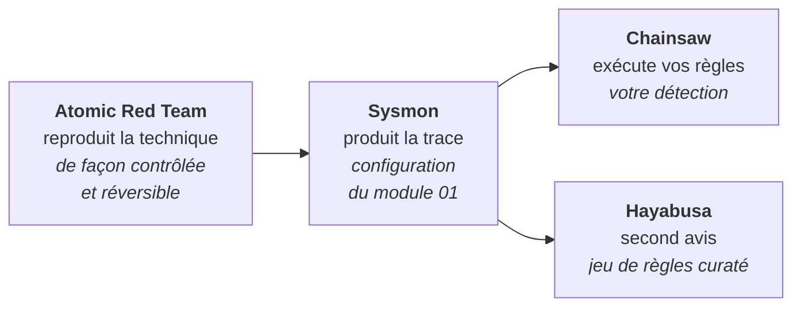

# Module 02 — La boucle de preuve

`Atomic Red Team · Hayabusa · Chainsaw` — prouver que les règles du module 01 détectent
réellement ce qu'elles prétendent détecter.

Le module 01 s'est arrêté à `Found 0 errors, 0 condition errors and 0 issues.` C'est une
validation **syntaxique**. Elle dit que les règles sont bien formées. Elle ne dit rien sur
leur capacité à se déclencher.

Ce module ferme cet écart.

---

## Le principe



Le module 01 allait de la technique vers la règle. Le module 02 fait le chemin inverse : on
rejoue la technique, et on regarde si la règle se réveille.

**La divergence entre Chainsaw et Hayabusa est le résultat le plus intéressant de la
campagne.** Hayabusa remonte quelque chose que vous ne voyez pas : vous avez un angle mort.
Vous remontez quelque chose qu'Hayabusa ignore : ce n'est pas forcément un faux positif —
votre configuration Sysmon collecte peut-être une donnée que leur jeu de règles n'attend
pas. Dans les deux cas il y a une phrase à écrire dans la matrice.

---

## Les trois outils, et pourquoi ces trois-là

### Atomic Red Team — le générateur de trace

Un catalogue public de tests courts, un par technique ATT&CK, avec sa procédure de
nettoyage. Il ne sert pas à « attaquer » : il sert à **produire une donnée dont on connaît
l'origine**. C'est la seule façon d'affirmer qu'une règle a déclenché *à cause de* quelque
chose de précis.

Ce dépôt ne recopie aucune de ses commandes. On lui demande son catalogue :

```powershell
Invoke-AtomicTest T1003.001 -ShowDetailsBrief
```

Une commande figée ici serait périmée dans six mois — exactement l'erreur que le module 01
a servi à éviter du côté des règles.

### Chainsaw — vos règles sur un EVTX

C'est lui qui exécute **les dix règles du module 01**, hors de tout SIEM, sur le fichier
journal exporté. Un test qui ne remonte pas ici est un échec de votre règle, pas d'un
produit.

Chainsaw a besoin d'un **mapping** : le fichier qui dit comment les champs Sigma
correspondent aux champs du journal Windows. C'est la couche de traduction du module 01,
sous un autre nom.

### Hayabusa — le second avis

Un jeu de règles maintenu et curaté par une équipe tierce. Il ne remplace pas vos règles, il
les juge. Lancer les deux sur le même EVTX et comparer, c'est l'exercice.

---

## Ce que contient ce dossier

```
02-boucle-de-preuve/
├── README.md                      ce fichier
├── plan-de-test.md                un test par règle : quoi lancer, quoi attendre
├── matrice-couverture.md          le livrable du module — à remplir
├── VERSIONS.md                    versions réelles de l'outillage, à remplir
├── scripts/
│   ├── Test-Preconditions.ps1     les 5 vérifications avant toute campagne
│   ├── Invoke-TestAtomique.ps1    marqueur → test → collecte → analyse → rapport
│   └── Invoke-Analyse.ps1         Chainsaw + Hayabusa sur un EVTX
├── preuves/                       exports EVTX horodatés
└── rapports/                      sorties d'analyse et rapports de test
```

---

## Garde-fous — à lire avant d'installer quoi que ce soit

Le module 02 exécute du code réellement malveillant sur la VM. Ce n'est pas une précaution
de principe.

| Règle | Détail |
|---|---|
| **Aucune route réseau** | `Test-NetConnection 8.8.8.8 -Port 53` doit rendre `False`. `Invoke-TestAtomique.ps1` refuse de s'exécuter sinon. |
| **Instantané avant campagne** | « VM outillée hors ligne », pris après installation de l'outillage et coupure réseau. |
| **Exclusion Defender bornée** | `C:\Lab` uniquement. Defender reste actif partout ailleurs. |
| **Test 09 en dernier** | La suppression des clichés instantanés est destructive et non réversible par le framework. |
| **Preuves exportées avant restauration** | Un instantané restauré emporte `preuves/` et `rapports/` avec lui. Poussez sur GitHub avant. |
| **Uniquement votre infrastructure** | Ces outils ne se lancent que sur une machine dont vous êtes responsable. |

---

## Ordre des opérations

**1. Vérifier avant de lancer**

```powershell
.\scripts\Test-Preconditions.ps1
```

Cinq contrôles : isolation réseau, service Sysmon, journal lisible, couverture des
événements, espace disque. Un échec, on ne teste pas.

**2. Renseigner les chemins de l'outillage**

Ouvrir `scripts/Invoke-Analyse.ps1` et corriger les quatre variables du bloc en tête. C'est
la seule partie des scripts qui dépend de vos versions. Reporter les numéros dans
`VERSIONS.md`.

**3. Choisir l'atomique**

```powershell
Invoke-AtomicTest T1003.001 -ShowDetailsBrief
```

Lire, choisir, noter le numéro dans la colonne « atomique retenu » de `plan-de-test.md`.

**4. Lancer la boucle**

```powershell
.\scripts\Invoke-TestAtomique.ps1 -Technique T1003.001 -NumeroTest 2 -Etiquette 01-lsass -Nettoyer
```

Le script produit un EVTX dans `preuves/`, deux sorties d'analyse et un rapport Markdown
dans `rapports/`, avec une section **Verdict** vide.

**5. Rendre le verdict**

Trois issues, une seule phrase chacune : règle validée, règle à corriger, donnée absente.
Le script mesure ; le jugement est votre travail. Reporter la ligne dans
`matrice-couverture.md`.

**6. Mesurer le bruit**

```powershell
.\scripts\Invoke-TestAtomique.ps1 -Etiquette bruit-repos -SansAtomique -Attente 3600
```

Une heure de VM au repos, aucun test. Toute alerte sur cette fenêtre est un faux positif et
se documente dans le champ `falsepositives` de la règle concernée.

**7. Pousser, puis restaurer**

```powershell
git add . ; git commit -m "module 02 : campagne du <date>" ; git push
```

Puis restaurer l'instantané. Dans cet ordre, jamais l'inverse.

---

## Le résultat attendu — et pourquoi il ne sera pas 10/10

Une campagne honnête sur dix règles écrites sans jamais avoir été confrontées à une trace
réelle ne donne pas dix validations. Elle donne, typiquement :

- quelques règles qui déclenchent proprement ;
- une ou deux qui déclenchent sur le mauvais critère ;
- une technique dont l'atomique choisi ne produit pas la trace attendue (`T1055` est le
  candidat le plus probable : toutes les variantes d'injection ne créent pas de thread
  distant) ;
- au moins un cas où la donnée n'a jamais existé, et où le défaut est dans
  `sysmon-config.xml`, pas dans la règle.

**Un 10/10 est un signal d'alerte, pas un succès.** Il signifie presque toujours que les
tests ont été choisis pour correspondre aux règles plutôt que l'inverse.

La matrice qui dit « 7 validées, 2 à corriger, 1 donnée absente » avec une phrase de
justification par ligne vaut infiniment plus, en entretien, qu'un tableau tout vert.

---

## Limites assumées

**Les atomiques ne sont pas des attaquants.** Ils reproduisent un geste isolé, sans
enchaînement, sans adaptation, sans évasion. Une règle qui passe un atomique n'a pas passé
une intrusion.

**Le lab reste mono-poste.** Ni domaine, ni mouvement latéral réel, ni volume. Les règles 10
(WMI) et 07 (LOLBin sortant) sont testées dans des conditions dégradées — c'est noté dans
`plan-de-test.md`, et c'est le module 05 qui corrigera cela avec un annuaire.

**Pas de SIEM.** Chainsaw et Hayabusa lisent un fichier. Il n'y a ni ingestion continue, ni
corrélation, ni latence réaliste. C'est le module 04.

---

## Module suivant

**03 — Suricata, Zeek : le réseau.** Le module 02 prouve ce que voit le capteur poste. Le
module 03 ajoute la vue réseau sur la même VM, et pose la question qui suit naturellement :
quelles techniques sont invisibles depuis l'hôte et ne se voient que sur le fil ?

---

*Mamadou Lamine Thiore — Master 2 Cybersécurité, EPSI Lyon — spécialisation Blue Team.*
