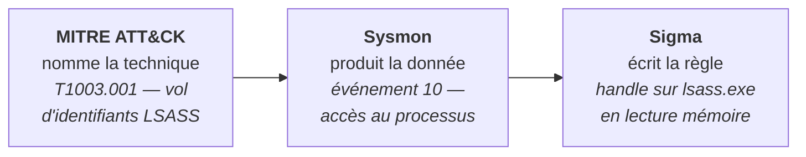
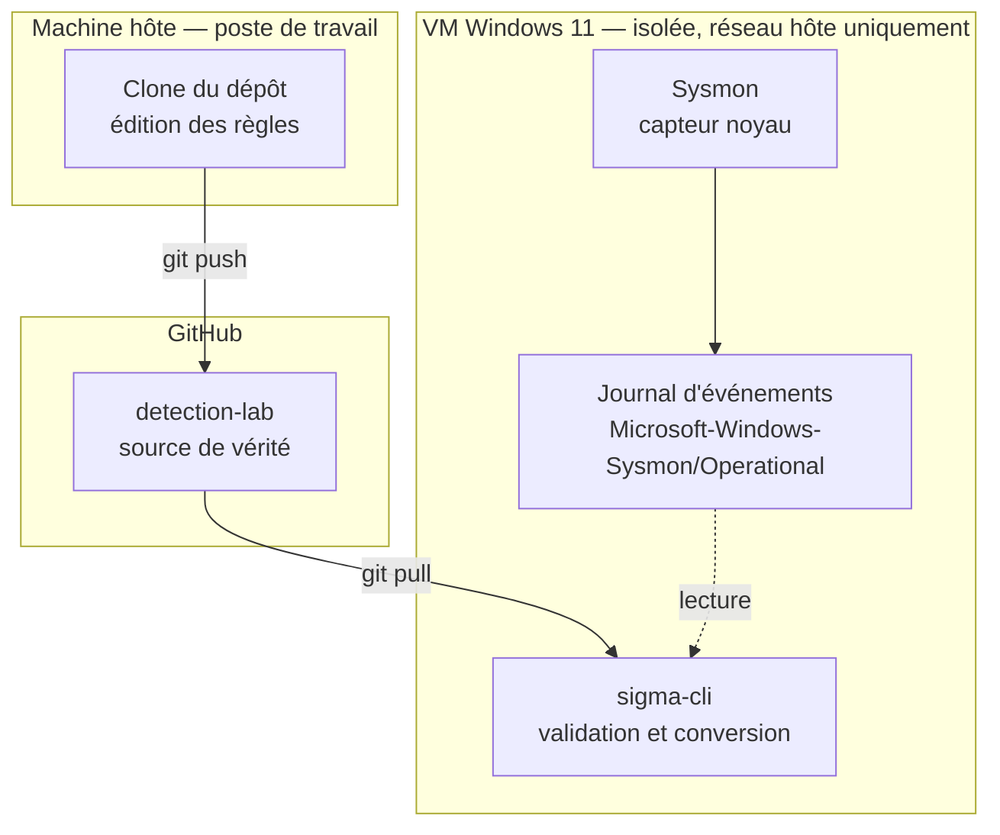
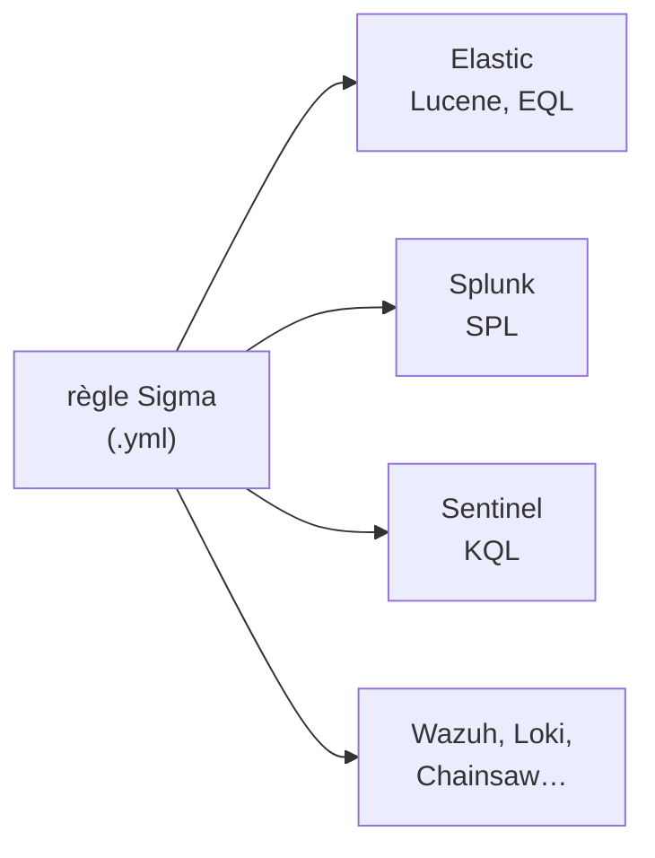
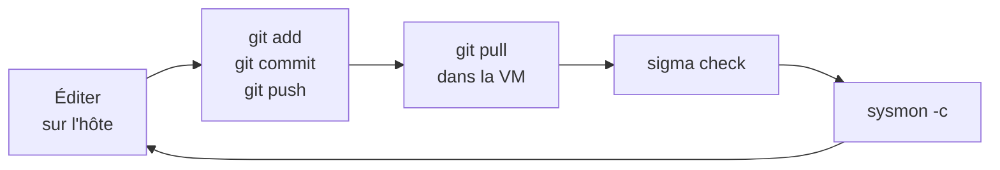

# detection-lab

**Banc d'essai de détection défensive** — construire la donnée avant d'écrire la règle,
puis prouver que la règle se déclenche.

`Sysmon v15.22` · `schéma 4.91` · `10 règles Sigma` · `0 erreur, 0 anomalie` · `MITRE ATT&CK v19`

---

## Ce que contient ce dépôt

Un environnement de détection Windows monté de zéro, instrumenté, mesuré et documenté.
Pas un tutoriel recopié : chaque choix de configuration est justifié, chaque règle est
accompagnée de ses faux positifs connus, et chaque affirmation est adossée à un relevé
horodaté dans `preuves/`.

Le dépôt grossit module par module. Le module 01 pose le socle : un capteur Windows
correctement configuré et dix règles de détection valides.

---

## Le principe qui structure tout

Trois outils, et un seul ordre possible.



**Écrire la règle avant d'avoir vérifié que la donnée existe produit une règle muette.**
C'est l'erreur la plus répandue chez un débutant, et elle est invisible : la règle se
charge sans erreur, ne remonte jamais rien, et on conclut à tort qu'elle est mauvaise.

Tout ce dépôt est construit pour rendre cette erreur impossible : on part de la technique,
on identifie la donnée, on vérifie qu'elle est collectée, **et seulement ensuite** on écrit
la règle.

---

## Architecture



**Deux machines, un dépôt.** On édite sur l'hôte, où l'on est à l'aise. On exécute dans la
VM, qui est isolée. Le dépôt GitHub est le seul pont entre les deux — pas de copie
manuelle, pas de dossier partagé, pas de version divergente.

La VM n'a **aucune route vers le réseau domestique**. Elle exécutera du code réellement
malveillant à partir du module 02 ; l'isolation n'est pas une précaution de principe.

---

## Les composants

### Sysmon — le capteur

Outil gratuit de Microsoft (suite Sysinternals). Il s'installe comme service Windows
accompagné d'un pilote noyau et observe l'activité système : création de processus,
connexions réseau, écritures dans le registre, accès mémoire entre processus.

**Ce n'est ni un antivirus ni un EDR.** Il n'analyse rien, ne bloque rien, ne remédie à
rien. Il observe et journalise — c'est exactement ce qu'on lui demande.

### Sigma — le format de règle

Un format ouvert, écrit en YAML, qui **décrit** ce qu'il faut chercher sans savoir où le
chercher. Un convertisseur traduit ensuite la description dans le langage du SIEM visé.



C'est ce qui rend le travail portable : une règle écrite ici sur un lab Elastic
fonctionnera chez un employeur sous Splunk ou Sentinel.

### MITRE ATT&CK — le référentiel

La langue commune. « Vol d'identifiants en mémoire LSASS » devient `T1003.001`, un
identifiant que tout le secteur comprend. Sans lui, on lit les rapports de menace en
traduction.

---

## La configuration Sysmon, expliquée

### Le piège fondamental

**Sysmon sans configuration ne journalise presque rien d'utile.** Les événements qui
portent l'essentiel de la valeur défensive sont désactivés par défaut.

| Événement | Ce qu'il apporte | Par défaut |
|---:|---|:---:|
| 1 | Création de processus — ligne de commande, parent, empreinte | actif |
| 3 | Connexion réseau — quel processus parle à quoi | **inactif** |
| 7 | Chargement de DLL dans un processus | **inactif** |
| 8 | Création de thread distant — injection de code | **inactif** |
| 10 | Accès à un processus — handle et droits demandés | **inactif** |
| 11 | Création de fichier | actif |
| 13 | Valeur de registre modifiée — persistance | **inactif** |
| 22 | Requête DNS | **inactif** |

**Cinq des dix règles de ce dépôt reposent sur un événement inactif par défaut.** Un poste
avec Sysmon « installé » mais non configuré est aveugle au vol d'identifiants, à
l'injection de code, à la persistance par le registre et aux connexions sortantes.

C'est le chiffre à retenir de tout le module 01.

### include et exclude — la distinction qui compte

Chaque groupe de règles choisit entre deux logiques opposées :

| | Logique | Effet d'une balise **vide** |
|---|---|---|
| `onmatch="include"` | Liste blanche — on ne journalise **que** ce qui correspond | ne journalise **rien** |
| `onmatch="exclude"` | Liste noire — on journalise **tout sauf** ce qui correspond | journalise **tout** |

C'est la source d'erreur la plus fréquente dans une configuration Sysmon. Quand une règle
reste muette, c'est le premier endroit à regarder — avant de soupçonner la règle elle-même.

La configuration de ce dépôt utilise délibérément les deux, avec un commentaire expliquant
le choix à chaque bloc.

### Les douze groupes configurés

| Groupe | Événement | Logique | Pourquoi ce choix |
|---|---:|---|---|
| Création de processus | 1 | exclude vide | Volume faible en lab ; filtrer trop tôt prive de la vision d'ensemble |
| Connexion réseau | 3 | include | Journaliser toutes les connexions est ingérable — on ne garde que les binaires détournés |
| Chargement de DLL | 7 | include | Un poste charge des milliers de DLL ; on ne garde que les répertoires inscriptibles |
| Thread distant | 8 | exclude | Volume naturellement nul — on retire juste le bruit système connu |
| Accès processus | 10 | include | **Sans filtre, cet événement sature le journal en dix minutes.** On ne garde que `lsass.exe` |
| Création de fichier | 11 | include | Emplacements de persistance et extensions exécutables uniquement |
| Registre | 12/13/14 | include | Le registre complet est ingérable — seules les ruches de persistance |
| Tubes nommés | 17/18 | include | Motifs des outils de post-exploitation connus |
| WMI | 19/20/21 | exclude vide | Volume quasi nul en fonctionnement normal : toute occurrence mérite un regard |
| Requêtes DNS | 22 | exclude | On retire le bruit Microsoft évident, on garde le reste |
| Suppression de fichier | 23 | include | Extensions d'exécution uniquement, pour limiter le coût disque |
| Altération de processus | 25 | exclude vide | Toute occurrence est anormale |

---

## Les dix règles

Chacune cible une technique ATT&CK distincte. La colonne « source » indique la catégorie
Sigma, c'est-à-dire l'événement Sysmon sous-jacent.

| # | Technique | Ce qu'elle détecte | Source | Niveau |
|---:|---|---|---|---|
| 01 | `T1003.001` | Handle en lecture mémoire sur `lsass.exe` | `process_access` | high |
| 02 | `T1059.001` | PowerShell lancé avec une commande encodée | `process_creation` | medium |
| 03 | `T1053.005` | Création de tâche planifiée en ligne de commande | `process_creation` | medium |
| 04 | `T1547.001` | Écriture dans une clé de démarrage automatique | `registry_set` | high |
| 05 | `T1055` | Thread distant créé vers un processus système | `create_remote_thread` | high |
| 06 | `T1218.011` | `rundll32` sans DLL ou depuis un répertoire utilisateur | `process_creation` | high |
| 07 | `T1105` | Binaire système détourné qui sort sur le réseau | `network_connection` | high |
| 08 | `T1543.003` | Service pointant vers un chemin inscriptible | `registry_set` | high |
| 09 | `T1490` | Suppression des clichés instantanés de volume | `process_creation` | **critical** |
| 10 | `T1047` | Processus lancé par le fournisseur WMI | `process_creation` | high |

**Cinq sources de données distinctes pour dix règles.** C'est délibéré : une couverture qui
reposerait entièrement sur la création de processus s'effondre dès qu'un attaquant évite
d'en créer un — ce que font la plupart des techniques modernes.

### Deux principes de rédaction

**On détecte le geste inévitable, pas l'outil.** La règle 01 ne cherche pas Mimikatz : elle
cherche l'ouverture d'un handle en lecture mémoire sur LSASS, ce que **tout** outil de vol
d'identifiants doit faire, quels que soient son nom, sa version ou son obfuscation. C'est
la différence entre une détection qui tient six mois et une qui meurt à la prochaine
recompilation du maliciel.

**Une règle sans faux positifs déclarés est une règle qui n'a jamais tourné.** Le champ
`falsepositives` de chaque règle dit ce qu'elle remonte à tort et comment trancher. Savoir
dire ce qu'une détection rate vaut plus que le nombre de règles écrites.

---

## Mesures de validation

Relevé du **20 septembre 2026**, sur les 200 derniers événements d'une VM au repos.

| Événement | Nombre | Règles alimentées |
|---:|---:|---|
| 12 | 71 | — |
| 13 | 40 | 04, 08 |
| 23 | 31 | — |
| 10 | 22 | 01 |
| 1 | 15 | 02, 03, 06, 09, 10 |
| 5 | 13 | — |
| 22 | 8 | — |

**Trois lectures.**

Le registre pèse **111 événements sur 200**, plus de la moitié du volume — alors qu'il est
déjà filtré sur les seules ruches de persistance. C'est l'argument chiffré qui justifie de
ne jamais collecter le registre en entier.

Les événements **3, 7, 8 et 11 n'apparaissent pas, et c'est voulu** : leurs filtres sont
des listes blanches étroites, rien ne les déclenche sur une machine au repos. Ils
s'activeront au module 02 sous les tests atomiques.

Un relevé antérieur comportait un événement **16 — la reconfiguration de Sysmon
elle-même.** En production, c'est un signal anti-altération de première importance : un
attaquant qui neutralise le capteur laisse cette trace.

### Validation des règles

```
sigma check ./01-socle-windows/sigma
→ Found 0 errors, 0 condition errors and 0 issues.
```

Ce résultat est arrivé **après correction de cinq défauts réels**, documentés dans le
[journal](01-socle-windows/JOURNAL.md) :

- **Trois blocs de détection orphelins** (gravité HIGH). Les règles 03, 04 et 08
  définissaient un bloc nommé `selection` et une condition `all of selection_*`. Le motif
  exige le tiret bas : le bloc n'était jamais évalué. Les règles se déclenchaient sur un
  critère au lieu de deux — faux positifs en masse.
- **Deux étiquettes ATT&CK invalides** (gravité MEDIUM). `attack.defense-evasion`
  n'existe plus : ATT&CK v19, publiée le 28 avril 2026, a scindé cette tactique en
  `stealth` (se fondre dans le légitime) et `defense-impairment` (casser les protections).
  Les règles 05 et 06 relèvent de la première.

> Ce second point illustre pourquoi la détection se gère comme du code : des règles écrites
> six jours plus tôt étaient devenues non conformes sans qu'une ligne ait bougé, parce que
> le référentiel a changé sous elles. Sans validation automatisée, la dérive serait passée
> inaperçue.

---

## Opérer le lab

### Le cycle quotidien



### Les commandes Sysmon à ne pas confondre

| Commande | Effet |
|---|---|
| `sysmon -accepteula -i <fichier>` | **Installe** le service. Échoue si déjà enregistré. |
| `sysmon -c <fichier>` | **Recharge** la configuration à chaud. |
| `sysmon -c` | **Affiche** la configuration active. |
| `sysmon -u` | Désinstalle. |

### Vérifier que le capteur voit

Ouvrir le gestionnaire des tâches — il ouvre un handle sur `lsass.exe` — puis :

```powershell
Get-WinEvent -LogName "Microsoft-Windows-Sysmon/Operational" -MaxEvents 50 |
  Where-Object { $_.Id -eq 10 } | Select-Object -First 5 TimeCreated, Id
```

Si rien ne sort, la configuration n'est pas appliquée. **Ne pas écrire une ligne de Sigma
avant d'avoir corrigé cela.**

### L'instantané de référence

La VM dispose d'un instantané **« VM outillée hors ligne »**, pris après installation
complète de l'outillage et coupure du réseau. Il sera restauré entre chaque test atomique
au module 02, pour garantir que chaque test parte d'un état identique.

---

## Structure du dépôt

```
detection-lab/
├── README.md                    ce fichier
└── 01-socle-windows/
    ├── JOURNAL.md               compte rendu de mise en place, obstacles inclus
    ├── matrice.md               technique → donnée → règle
    ├── convert.sh               conversion des règles vers trois cibles
    ├── sysmon/
    │   └── sysmon-config.xml    configuration commentée bloc par bloc
    ├── sigma/                   les dix règles
    └── preuves/                 captures horodatées
```

---

## Limites assumées

Les nommer vaut mieux que laisser croire à une couverture complète.

**Dix règles ne couvrent pas ATT&CK.** Les tactiques *reconnaissance*, *accès initial*,
*découverte*, *collecte* et *exfiltration* ne sont pas traitées.

**La configuration Sysmon est pédagogique, pas de production.** Elle est volontairement
courte et permissive pour rester lisible ligne à ligne. Une configuration de production
(SwiftOnSecurity, Olaf Hartong) fait plusieurs milliers de lignes d'exclusions.

**Aucune règle n'a encore été confrontée à une attaque réelle.** Elles sont
syntaxiquement valides et leur donnée existe — c'est tout ce qui est prouvé à ce stade. Le
module 02 apportera la mesure de couverture.

**Le lab est mono-poste.** Ni domaine, ni SIEM centralisé, ni volume réaliste.

---

## Feuille de route

| Module | Sujet | État |
|---:|---|---|
| 01 | Sysmon + Sigma — le socle | **terminé** |
| 02 | Atomic Red Team, Hayabusa, Chainsaw — la boucle de preuve | à venir |
| 03 | Suricata, Zeek — le réseau | à venir |
| 04 | Elastic Security — la plateforme | à venir |
| 05 | GOAD, BloodHound, PingCastle — l'annuaire | à venir |
| 06 | Velociraptor, Stratus Red Team, KQL — parc et cloud | à venir |
| 07 | GLPI, supervision — le socle technicien | à venir |

Les modules s'enchaînent sur **une seule infrastructure qui grossit** : la VM du module 01
devient la cible du module 02, alimente le SIEM du module 04, rejoint l'annuaire du
module 05.

---

## Glossaire

**Faux positif** — Alerte déclenchée sur une activité légitime. Une règle qui en produit
trop est désactivée en deux semaines, donc inutile.

**LOLBin** *(living-off-the-land binary)* — Binaire signé et livré avec Windows, détourné
par un attaquant pour faire exécuter son code par un processus de confiance. `rundll32`,
`certutil`, `mshta`.

**LSASS** — Processus Windows qui détient les secrets d'authentification en mémoire. La
cible de tout outil de vol d'identifiants.

**Persistance** — Mécanisme qui permet à un code de se relancer après redémarrage : clé de
registre, tâche planifiée, service.

**Sigma** — Format ouvert de description de règles de détection, indépendant du SIEM.

**Sysmon** — Capteur d'activité système de Microsoft, journalise sans bloquer.

**TTP** *(tactiques, techniques et procédures)* — Manière de décrire un comportement
d'attaquant plutôt qu'un indicateur ponctuel. Une TTP survit à un changement d'outil ; une
empreinte de fichier non.

---

*Mamadou Lamine Thiore — Master 2 Cybersécurité, EPSI Lyon — spécialisation Blue Team.*
